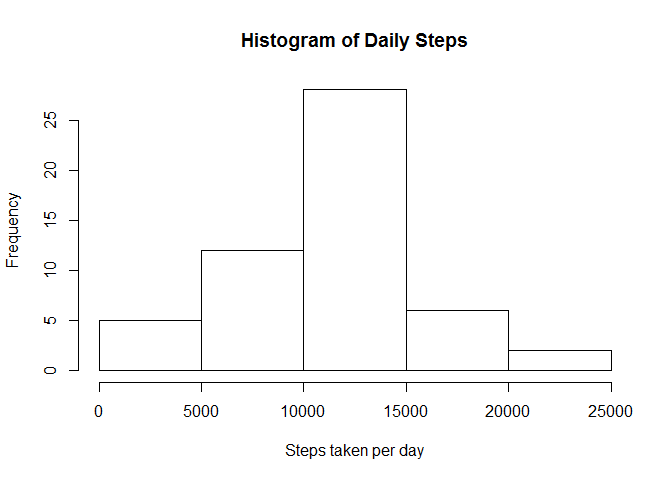
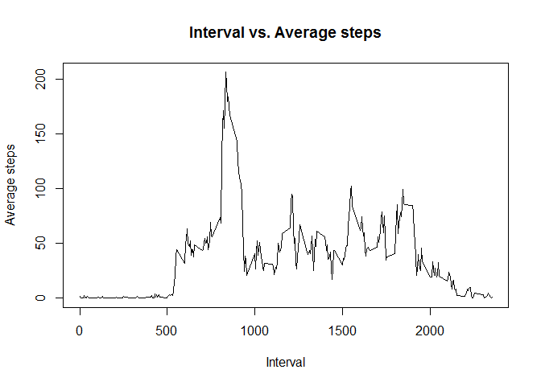
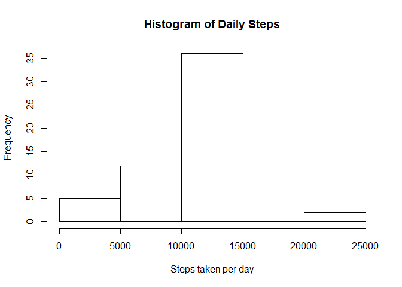

# Reproducible Research: Peer Assessment 1

## Loading and preprocessing the data
First things first. The data is available [here](http://github.com/rdpeng/RepData_PeerAssessment1). The following R code from this point on assumes that the data is in your working directory. Unzip and load the csv file into R.

```r
unzip('activity.zip')
data <- read.csv('activity.csv')
```
Now it's time to reformat the date column.

```r
data$date <- as.Date(data$date)
```

## What is mean total number of steps taken per day?
The easiest way to do this is to load up the dplyr package and use the group_by and summarize commands to get the sum of steps for each day, which can then be averaged.


```r
library(dplyr)
```

```
## 
## Attaching package: 'dplyr'
## 
## The following object is masked from 'package:stats':
## 
##     filter
## 
## The following objects are masked from 'package:base':
## 
##     intersect, setdiff, setequal, union
```

1. Calculate the total number of steps taken per day.

```r
by_date <- group_by(data,date)
sums <- summarize(by_date,stepsum=sum(steps))
```


2. Make a histogram of the total number of steps taken each day.

```r
hist(sums$stepsum, main= 'Histogram of Daily Steps',xlab='Steps taken per day')
```

 

3. Finally, the mean number of steps taken per day.


```r
mean(sums$stepsum,na.rm=TRUE)
```

```
## [1] 10766.19
```

And the median.

```r
median(sums$stepsum, na.rm=TRUE)
```

```
## [1] 10765
```
## What is the average daily activity pattern?
1. Make a time series plot of the 5-minute interval and the average number of steps taken, averaged accross all days.

Same idea. Though this time plot the means rather than the sums (also barplot, not histogram).

```r
by_interval <- group_by(data,interval)

means <- summarize(by_interval,average=mean(steps,na.rm=TRUE))

plot(means$interval,means$average,type='l',xlab='Interval',ylab='Average steps',main='Interval vs. Average steps')
```

 

2. Which interval, on average across all the days in the dataset, contains the maximum number of steps?

I used the max function and had it search for the corresponding interval.


```r
means$interval[which(means$average==max(means$average))]
```

```
## [1] 835
```
Interval 835.

## Imputing missing values

1. Calculate and report the total number of missing values in the dataset.


```r
sum(!complete.cases(data))
```

```
## [1] 2304
```

2. & 3. Devise a strategy for filling in all of the missing values in the dataset and create a new set with missing data filled in.

For the purposes of this assignment, I'm going to use the average number of steps taken per interval for our replacement value.


```r
data[is.na(data)] <- mean(data$steps,na.rm=TRUE)
```

4. Make a histogram of the total number of steps taken each day.


```r
by_date <- group_by(data,date)
sums <- summarize(by_date,stepsum=sum(steps))
hist(sums$stepsum, main= 'Histogram of Daily Steps',xlab='Steps taken per day')
```

 

The new mean.

```r
mean(sums$stepsum,na.rm=TRUE)
```

```
## [1] 10766.19
```
And the new median.

```r
median(sums$stepsum, na.rm=TRUE)
```

```
## [1] 10766.19
```

So we can see that using this method did not change the mean, however it did slighty change our median (which is now equal to our mean).  Replacing the missing values largely just made our histogram taller (though it retained its basic distribution/shape).

## Are there differences in activity patterns between weekdays and weekends?

```r
library(lubridate)
```

```
## Warning: package 'lubridate' was built under R version 3.2.1
```

```r
1. 
```

```
## [1] 1
```
